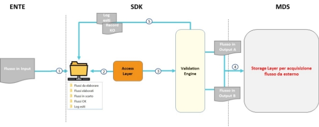

# **1 Architettura SDK**

## ***1.1 Architettura funzionale***

Di seguito una rappresentazione architetturale del processo di gestione e trasferimento dei flussi dall’ente verso l’area MdS attraverso l’utilizzo dell’applicativo SDK, e il corrispondente diagramma di sequenza.

1. L’utente dell’ente caricherà in una apposita directory (es. /sdk/input/) il flusso sorgente.  L’utente avvierà l’SDK passando in input una serie di parametri descritti in dettaglio al paragrafo 3.1
1. La componente Access Layer estrae dalla chiamata dell’ente i parametri utilizzati per lanciare l’SDK,  genera un identificativo ID\_RUN, e un file chiamato “{ID\_RUN}.json” in cui memorizza le informazioni dell’esecuzione.
1. I record del flusso verranno sottoposti alle logiche di validazione e controllo definite nel Validation Engine. Nel processare il dato, il Validation Engine acquisirà da MdS eventuali anagrafiche di validazione del dato stesso.
1. Generazione del file degli scarti contenente tutti i record in scarto con evidenza degli errori riscontrati. I file di scarto saranno memorizzati in cartelle ad hoc (es. /sdk/esiti).
1. Tutti i record che passeranno i controlli verranno inseriti in un file xml copiato in apposita cartella (es /sdk/xml\_output), il quale verrà eventualmente trasferito a MdS utilizzando la procedura “invioFlussi” esposta da GAF WS (tramite PDI). A fronte di un’acquisizione, il MdS fornirà a SDK un identificativo (ID\_UPLOAD) che sarà usato da SDK sia per fini di logging che di recupero del File Unico degli Scarti.
1. A conclusione del processo di verifica dei flussi, il Validation Engine eseguirà le seguenti azioni:

 a. Aggiornamento file contentente il riepilogo dell’esito dell’elaborazione del Validation Engine e del ritorno dell’esito da parte di MdS. I file contenente l’esito dell’elaborazione saranno memorizzati in cartelle ad hoc (es. /sdk/run).

 b. Consolidamento del file di log applicativo dell’elaborazione dell’SDK in cui sono disponibili una serie di informazioni tecniche (Es. StackTrace di eventuali errori).

 c. Copia del file generato al punto 5, se correttamente inviato al MdS, in apposita cartella (es. /sdk/sent).

Ad ogni step del precedente elenco e a partire dal punto 2, l’SDK aggiornerà di volta in volta il file contenente l’esito dell’elaborazione.

**Nota: l’SDK elaborerà un solo file di input per esecuzione.**

In generale, le classi di controllo previste su Validation Engine sono:

- Controlli FORMALI (es. correttezza dei formati e struttura record)
- Controlli SINTATTICI (es. check correttezza del Codice Fiscale)
- Controlli di OBBLIGATORIETÀ DEL DATO (es. Codice Prestazione su flusso…)
- Controlli STRUTTURE FILE (es. header/footer ove applicabile)
- Controlli di COERENZA CROSS RECORD
- Controlli di corrispondenza dei dati trasmessi con le anagrafiche di riferimento;
- Controlli di esistenza di chiavi duplicate nel file trasmesso rispetto alle chiavi logiche individuate per ogni tracciato.

Si sottolinea che la soluzione SDK non implementa controlli che prevedono la congruità del dato input con la base date storica (es. non viene verificato se per un nuovo inserimento (Tipo = I) la chiave del record non sia già presente sulla struttura dati MdS).

## ***2.1 Architettura di integrazione***

La figura sottostante mostra l’architettura di integrazione della soluzione SDK con il MdS. Si evidenzia in particolare che:

- Tutti i dati scambiati fra SDK e MdS saranno veicolati tramite Porta di Interoperabilità (PDI);
- Il MdS esporrà servizi (API) per il download di dati anagrafici;
- SDK provvederà ad inviare vs MdS l’output (record validati) delle proprie elaborazioni. A fronte di tale invio, il MdS provvederà a generare un identificativo di avvenuta acquisizione del dato (ID\_UPLOAD) che SDK memorizzerà a fini di logging.

